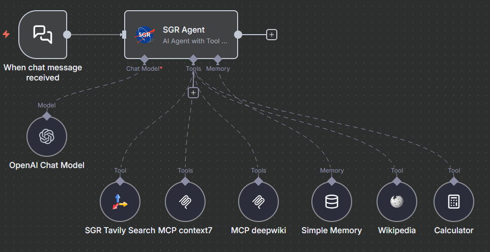

# n8n-nodes-sgr-tool-calling



AI research agent with OpenAI function calling for n8n. Port of [sgr-deep-research](https://github.com/vamplabAI/sgr-deep-research) Python project.

**Copyright (C) 2025 MiXaiLL76 (mike.milos@yandex.ru)**

[n8n](https://n8n.io/) is a [fair-code licensed](https://docs.n8n.io/reference/license/) workflow automation platform.

## Installation

Follow the [installation guide](https://docs.n8n.io/integrations/community-nodes/installation/) in the n8n community nodes documentation.

## Quick Start

1. Add **SGR Agent** node to your workflow
2. Connect **AI Language Model** (OpenAI, Anthropic, etc.)
3. Connect **AI Tools** (optional): search, MCP, LangChain tools
4. Connect **Memory** (optional): for conversation history

### Example Workflow

```
Chat Trigger → SGR Agent → Output
              ↓ ↓ ↓ ↓
        [Model][Tools][Memory]
```

Import **[SGR_Example.json](https://github.com/MiXaiLL76/sgr_tool_calling/blob/main//SGR_Example.json)** to get started.

## Features

### Built-in Tools

Agent uses 6 system tools for research tasks:

- `reasoning_tool` - analyze task and plan next steps
- `final_answer_tool` - complete task execution
- `create_report_tool` - generate detailed reports with citations
- `clarification_tool` - ask clarifying questions
- `generate_plan_tool` - create research plans
- `adapt_plan_tool` - adjust plans based on findings

All tools can be enabled/disabled in node settings.

### Connected Tools

Connect any n8n AI Tool:

- **SGR Tavily Search** - web search (included)
- **MCP Client Tool** - Model Context Protocol integrations
- **LangChain Tools** - calculators, code interpreters, etc.
- Supports the `/tools` command to display all connected tools

Agent automatically highlights connected tools when they execute.

### Memory

Connect n8n Memory node for conversation history:

- Remembers previous interactions within session
- Automatically clears when `sessionId` changes
- Supports `/clear` and `/new` commands
- Only stores user questions and final answers (not internal reasoning)

### Limits

Configure resource constraints:

- **Max Iterations** (default: 10) - reasoning cycles before stopping
- **Max Searches** (default: 4) - web search limit
- **Max Clarifications** (default: 3) - clarification request limit

### Custom Prompts

Override default prompts:

- **System Prompt** - agent behavior instructions
- **Initial User Request Template** - format task presentation
- **Clarification Response Template** - format clarification responses

## Resources

- [n8n community nodes documentation](https://docs.n8n.io/integrations/#community-nodes)
- [SGR Deep Research (Original Python Project)](https://github.com/vamplabAI/sgr-deep-research)
- [n8n AI Agents Documentation](https://docs.n8n.io/integrations/builtin/cluster-nodes/root-nodes/n8n-nodes-langchain.agent/)

## License

This project is licensed under **AGPL-3.0** - see the [LICENSE](LICENSE) file for details.

### Commercial Licensing

**AGPL-3.0** requires you to open-source your modifications and provide source code to users if you run this software as a network service.

**For commercial use** where you want to:

- Keep your modifications private
- Integrate into proprietary software
- Provide as a managed service without open-sourcing

**Contact for a commercial license:** [mike.milos@yandex.ru](mailto:mike.milos@yandex.ru)

### Free Use Cases

This software is **free** for:

- ✅ Personal use
- ✅ Educational purposes
- ✅ Research projects
- ✅ Open-source projects (compliant with AGPL-3.0)

If you modify and deploy this software as a network service, you must provide source code to your users under AGPL-3.0 terms.
